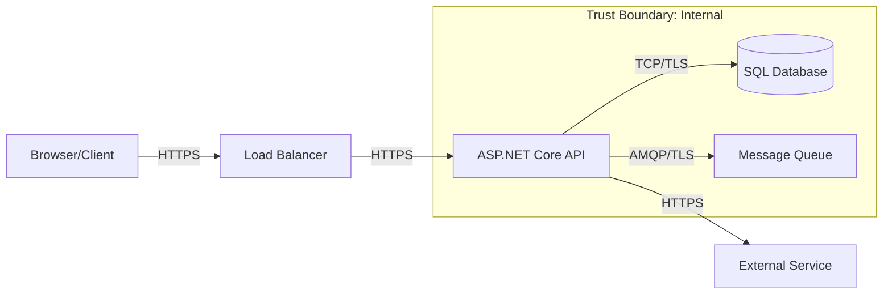

# SDLC Threat Modeling

## Primary Directive

Generate STRIDE-based threat models for .NET application components by analyzing architecture documentation, code structure, and data flows.

## Workflow

### Step 1: Identify Scope
- Read architecture diagrams and ADRs
- Identify the component/feature to threat model
- Map data flows, trust boundaries, and external interfaces

### Step 2: STRIDE Analysis

For each component/data flow, analyze:

| Category | Question | .NET Focus |
|----------|----------|-----------|
| **Spoofing** | Can an attacker impersonate a user/system? | JWT validation, Azure AD config, API key management |
| **Tampering** | Can data be modified in transit/at rest? | HTTPS, data protection API, EF Core parameterized queries |
| **Repudiation** | Can actions be denied? | Audit logging, structured logging, event sourcing |
| **Information Disclosure** | Can sensitive data leak? | Error handling, log sanitization, CORS, response filtering |
| **Denial of Service** | Can the service be overwhelmed? | Rate limiting, pagination, async patterns, resource limits |
| **Elevation of Privilege** | Can access controls be bypassed? | Authorization policies, IDOR checks, claim validation |

### Step 3: Output Threat Model

```markdown
# Threat Model: {Component Name}

**Date**: {YYYY-MM-DD}
**Author**: SDLC Security Agent
**Status**: Draft | Reviewed | Approved
**Linked ADR**: ADR-{NNN}

## 1. System Description
{Component purpose, technology stack, data handled}

## 2. Data Flow Diagram



## 3. Assets

| Asset | Classification | Storage | Protection |
|-------|---------------|---------|------------|
| User PII | Confidential | Azure SQL (encrypted) | TDE + column encryption |
| JWT Tokens | Secret | Memory / Client | Signed + short TTL |
| API Keys | Secret | Azure Key Vault | Managed identity access |
| Audit Logs | Internal | Azure Monitor | Immutable storage |

## 4. Threats

| ID | STRIDE | Threat | Target | Impact | Likelihood | Risk | Mitigation | Status |
|----|--------|--------|--------|--------|------------|------|------------|--------|
| T-001 | S | Token forgery | Auth | Critical | Low | Medium | RSA-signed JWT, issuer validation | ✅ Mitigated |
| T-002 | T | SQL injection | DB | Critical | Medium | High | EF Core parameterized + validation | ✅ Mitigated |
| T-003 | I | Stack trace in response | API | Medium | High | High | ProblemDetails, no dev exceptions | ✅ Mitigated |
| T-004 | D | Unbounded query | API | High | Medium | High | Pagination + rate limiting | 🔄 Partial |
| T-005 | E | Missing auth on endpoint | API | Critical | Medium | Critical | [Authorize] default, policy checks | ✅ Mitigated |

## 5. Residual Risks

| Risk | Severity | Justification |
|------|----------|---------------|
| {Remaining risk} | {Low/Medium} | {Why it's acceptable} |
```

## .NET-Specific Threat Patterns

| Threat | Detection | Mitigation |
|--------|-----------|-----------|
| Mass assignment | Controller accepts full entity | Use DTOs with explicit properties |
| Over-posting | Bind model without `[BindProperty]` filter | FluentValidation + explicit binding |
| IDOR | Direct object reference in URL | Ownership verification in handler |
| Insecure deserialization | `JsonSerializer` with `TypeNameHandling` | Use `System.Text.Json` defaults |
| SSRF | User-provided URL in HttpClient | URL allowlist + `IHttpClientFactory` |
| Log injection | User input in log messages | Structured logging parameters |

## Output Location

Save to: `docs/security/threat-models/{component-name}.md`
