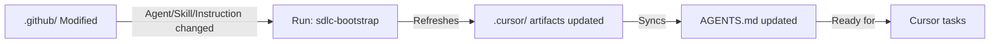

# Cursor SDLC Environment Setup Guide — MyProject

**Project**: MyProject  
**Version**: 2.0  
**Last Updated**: April 23, 2026  
**Target**: .NET 8.0 | ASP.NET Core + Razor Pages | Clean Architecture with CQRS

---

## 🚀 Quick Start (5 minutes)

### Step 1: Read the Entry Point
Start with [`AGENTS.md`](./AGENTS.md) — This is your Cursor agent registry and explains how to invoke specialist agents.

### Step 2: Review Project Configuration
Open [`.github/sdlc-config.json`](./.github/sdlc-config.json) — This defines the entire project profile.

### Step 3: Run Bootstrap Command
Execute the `sdlc-bootstrap` command in Cursor to set up the complete environment.

### Step 4: Validate Setup
Use the validation checklist in [CURSOR-README.md](./CURSOR-README.md#validation-checklist) to confirm everything is working.

---

## 📁 Complete Cursor Environment Structure

```
Cursor Environment for MyProject
├── AGENTS.md ⭐ (START HERE)
│   └── Entry point for all Cursor tasks
│       Includes agent registry, skill reference, project config
│
├── CURSOR-README.md (Main Documentation)
│   ├── Project profile & tech stack
│   ├── Source-of-truth policy
│   ├── Mapping matrices (agents, skills, rules)
│   ├── Quick start guide
│   ├── Bootstrap command (detailed)
│   └── Validation checklist
│
├── SDLC-BOOTSTRAP-COMMAND.md (Copy-Paste Setup)
│   ├── How to set up Cursor reusable command
│   ├── Full bootstrap prompt (copy & paste ready)
│   └── When to run bootstrap
│
├── .cursor/rules/ (6 Context Rules)
│   ├── 00-sdlc-core.mdc ⭐ (MANDATORY)
│   │   └── Source-of-truth policy, Cursor routing
│   ├── 10-dotnet.mdc (C# conventions)
│   ├── 20-testing.mdc (MSTest standards)
│   ├── 30-security.mdc (OWASP Top 10)
│   ├── 40-documentation.mdc (API docs, ADRs)
│   └── 50-code-review.mdc (PR standards)
│
├── .cursor/agents/ (12 Specialist Agents)
│   ├── sdlc-orchestrator.agent.md (Master coordination)
│   ├── sdlc-requirements.agent.md (Requirements engineering)
│   ├── sdlc-architect.agent.md (Architecture & ADRs)
│   ├── sdlc-implementer.agent.md (Code implementation)
│   ├── sdlc-reviewer.agent.md (Code review)
│   ├── sdlc-tester.agent.md (Testing & QA)
│   ├── sdlc-devops.agent.md (CI/CD & DevOps)
│   ├── sdlc-security.agent.md (Security & threats)
│   ├── sdlc-compliance.agent.md (Compliance)
│   ├── sdlc-documentation.agent.md (Documentation)
│   ├── sdlc-research.agent.md (Research & analysis)
│   └── prompt-engineer.agent.md (Prompt optimization)
│
├── .cursor/skills/ (6 Reusable Workflows)
│   ├── sdlc-bootstrap/SKILL.md (Setup & sync)
│   ├── sdlc-ci-pipeline/SKILL.md (GitHub Actions)
│   ├── sdlc-dependency-review/SKILL.md (NuGet analysis)
│   ├── sdlc-release-notes/SKILL.md (Release automation)
│   ├── sdlc-threat-model/SKILL.md (STRIDE modeling)
│   └── sdlc-traceability/SKILL.md (Requirements RTM)
│
└── .github/ (CANONICAL - Read Only)
    ├── sdlc-config.json (Project config)
    ├── copilot-instructions.md (Master instructions)
    ├── agents/ (12 agent specifications)
    ├── skills/ (6 skill workflows)
    └── instructions/ (5 coding standards)
```

---

## 🎯 Specialist Agents Available

Use these agents for complex, domain-specific tasks:

| Agent | When to Use | Example |
|-------|-----------|---------|
| **@sdlc-orchestrator** | Multi-phase delivery | "Implement user login feature end-to-end" |
| **@sdlc-requirements** | Requirements & user stories | "Create acceptance criteria for order checkout" |
| **@sdlc-architect** | System design & ADRs | "Design the authorization system" |
| **@sdlc-implementer** | Code scaffolding | "Generate CQRS handler for new feature" |
| **@sdlc-reviewer** | Code quality & security | "Review this pull request for best practices" |
| **@sdlc-tester** | Test generation | "Write unit tests for this repository class" |
| **@sdlc-devops** | CI/CD pipelines | "Create deployment pipeline for staging" |
| **@sdlc-security** | Security analysis | "Threat model the authentication flow" |
| **@sdlc-compliance** | Governance & licensing | "Check NuGet packages for license compliance" |
| **@sdlc-documentation** | API docs & guides | "Generate API documentation from code" |
| **@sdlc-research** | Technology research | "Compare caching libraries for performance" |
| **@sdlc-prompt-engineer** | Prompt optimization | "Improve this prompt for better results" |

---

## 🔧 Reusable Skills Available

Use these for repeatable, complex workflows:

| Skill | Purpose | When to Use |
|-------|---------|-----------|
| **sdlc-bootstrap** | Setup Cursor environment | Initial setup, after .github updates |
| **sdlc-ci-pipeline** | Generate GitHub Actions | Setting up CI/CD workflows |
| **sdlc-dependency-review** | NuGet package analysis | Adding new dependencies, license checks |
| **sdlc-release-notes** | Auto-generate release notes | Before releases, from commits & PRs |
| **sdlc-threat-model** | STRIDE threat modeling | Security design reviews |
| **sdlc-traceability** | Requirements traceability matrix | Linking requirements → code → tests |

---

## 📋 Coding Standards Applied by File Type

Rules are applied automatically based on file type:

| Rule | Applied To | Standards |
|------|-----------|-----------|
| **00-sdlc-core** | All tasks | Source-of-truth routing, canonical references |
| **10-dotnet** | `src/**/*.cs`, `tests/**/*.cs` | .NET 8 conventions, naming, async patterns |
| **20-testing** | `tests/**/*Test*.cs` | MSTest, assertions, mocking, coverage |
| **30-security** | All code & config | OWASP Top 10, input validation, secrets |
| **40-documentation** | `**/*.md`, `**/*.cs` | API docs, ADRs, markdown standards |
| **50-code-review** | `**/*.cs`, `**/*.md` | PR checklist, conventional commits |

---

## 🔄 Synchronization Workflow

### When .github Changes → Update Cursor



### Synchronization Steps

1. **Update Canonical Source** (`.github/`)
   - Edit agent, skill, or instruction file
   - Commit changes

2. **Run Bootstrap Command**
   - Open Command Palette in Cursor
   - Type: `sdlc-bootstrap`
   - Press Enter

3. **Verify Synchronization**
   - Check `.cursor/` artifacts updated
   - Review `AGENTS.md` updated
   - Run validation checklist

---

## 📖 Complete Documentation

### Primary References

1. **[AGENTS.md](./AGENTS.md)** ⭐
   - Cursor agent registry
   - How to invoke agents
   - Project configuration summary

2. **[CURSOR-README.md](./CURSOR-README.md)**
   - Comprehensive setup guide
   - Mapping matrices
   - Source-of-truth policy
   - Validation checklist

3. **[SDLC-BOOTSTRAP-COMMAND.md](./SDLC-BOOTSTRAP-COMMAND.md)**
   - How to set up Cursor reusable command
   - Copy-paste ready bootstrap prompt
   - When to run bootstrap

### Canonical Sources (Read-Only)

4. **[.github/sdlc-config.json](./.github/sdlc-config.json)**
   - Project configuration
   - Framework, architecture, tech stack
   - Enabled agents, quality thresholds

5. **[.github/copilot-instructions.md](./.github/copilot-instructions.md)**
   - Master SDLC instructions
   - Project overview
   - Tech stack details

6. **[docs/sdlc-automation/SDLC-PROCESS-CATALOG.md](./docs/sdlc-automation/SDLC-PROCESS-CATALOG.md)**
   - Full SDLC process documentation
   - Each process phase explained

7. **[docs/sdlc-automation/PHASED-ROLLOUT-PLAN.md](./docs/sdlc-automation/PHASED-ROLLOUT-PLAN.md)**
   - Implementation roadmap
   - Phase-by-phase guidance

---

## 🚦 Setup Checklist

Complete these steps to get Cursor fully operational:

### Phase 1: Initial Setup (First Time)
- [ ] Read [AGENTS.md](./AGENTS.md)
- [ ] Review [.github/sdlc-config.json](./.github/sdlc-config.json)
- [ ] Read [CURSOR-README.md](./CURSOR-README.md) Quick Start section
- [ ] Open [SDLC-BOOTSTRAP-COMMAND.md](./SDLC-BOOTSTRAP-COMMAND.md)

### Phase 2: Cursor Configuration
- [ ] Copy bootstrap prompt from [SDLC-BOOTSTRAP-COMMAND.md](./SDLC-BOOTSTRAP-COMMAND.md)
- [ ] Set up Cursor reusable command: `sdlc-bootstrap`
- [ ] Paste prompt into command settings
- [ ] Save command

### Phase 3: Bootstrap Environment
- [ ] Run command: `sdlc-bootstrap` in Cursor
- [ ] Wait for migration report
- [ ] Check output for any issues

### Phase 4: Validation
- [ ] Open [CURSOR-README.md](./CURSOR-README.md#validation-checklist)
- [ ] Run through all validation checkpoints
- [ ] Verify all 12 agents exist
- [ ] Verify all 6 skills exist
- [ ] Verify all 6 rules exist
- [ ] Check AGENTS.md is complete

### Phase 5: Ready to Work
- [ ] Invoke @sdlc-orchestrator with a task
- [ ] Test a specialist agent (@sdlc-architect, @sdlc-implementer, etc.)
- [ ] Try a reusable skill (e.g., sdlc-dependency-review)
- [ ] Confirm coding rules apply to files

---

## 🔍 Validation Quick Check

After bootstrap, verify:

```
✓ All .cursor/ files exist (6 rules, 12 agents, 6 skills)
✓ AGENTS.md is complete and lists all agents
✓ Each Cursor file references its .github/ canonical source
✓ No .github/ files were modified
✓ File globs in rules match repository patterns
✓ All cross-references are valid
```

For detailed validation, see [CURSOR-README.md#validation-checklist](./CURSOR-README.md#validation-checklist).

---

## 🛠️ Troubleshooting

### Problem: Cursor not recognizing agents

**Solution**: 
1. Verify `AGENTS.md` exists and is complete
2. Check `.cursor/agents/` contains all 12 `.agent.md` files
3. Re-run `sdlc-bootstrap` command

### Problem: Rules not applying to files

**Solution**:
1. Check `.cursor/rules/` exists with all 6 files
2. Verify file globs match your code structure
3. Confirm rules have proper YAML frontmatter
4. Restart Cursor editor

### Problem: Out of sync with .github updates

**Solution**:
1. Run `sdlc-bootstrap` command
2. Review migration report
3. Check AGENTS.md updated

### Problem: Missing documentation

**Solution**:
1. Verify all files in this guide exist
2. Check [CURSOR-README.md](./CURSOR-README.md) for detailed info
3. Review [.github/copilot-instructions.md](./.github/copilot-instructions.md)

---

## 📞 Support

- **Questions**: Check [CURSOR-README.md](./CURSOR-README.md#troubleshooting)
- **Issues**: Create an issue with specifics
- **Improvements**: Submit PRs for better setup

---

## 🎓 Learning Path

### Beginner (Understand the Setup)
1. Read this file (top to bottom)
2. Review [AGENTS.md](./AGENTS.md)
3. Open [CURSOR-README.md](./CURSOR-README.md)

### Intermediate (Use Agents & Skills)
1. Invoke `@sdlc-orchestrator` with a simple task
2. Use `@sdlc-implementer` for code generation
3. Use `@sdlc-tester` for test writing

### Advanced (Complex Workflows)
1. Use `@sdlc-orchestrator` for multi-phase delivery
2. Combine agents (architect + implementer)
3. Create custom workflows with skills

---

## 📊 Project Profile Summary

| Property | Value |
|----------|-------|
| **Project** | MyProject |
| **Type** | ASP.NET Core + Razor Pages |
| **.NET Version** | 8.0 |
| **Architecture** | Clean Architecture with CQRS |
| **Testing** | MSTest (80% coverage) |
| **Cloud** | Azure (App Service, Key Vault) |
| **Security** | CodeQL, Dependabot, OWASP Top 10 |
| **CI/CD** | GitHub Actions |
| **Cursor Agents** | 12 specialist agents |
| **Cursor Skills** | 6 reusable workflows |
| **Cursor Rules** | 6 context rules |

---

**Last Updated**: April 23, 2026  
**Cursor Version Required**: v0.42+  
**SDLC Suite**: 2.0  
**Status**: ✅ Production Ready

For detailed information, start with [AGENTS.md](./AGENTS.md) or [CURSOR-README.md](./CURSOR-README.md).
