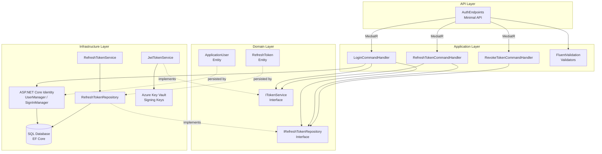
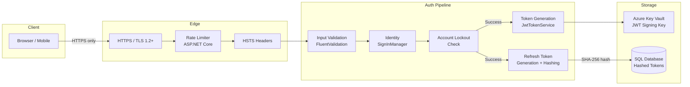
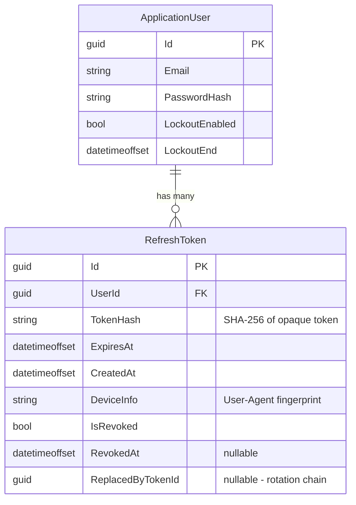

# ADR-LOGIN-001: JWT + Refresh Token Authentication for Email/Password Login

## Status

Proposed

## Date

2026-04-01

## Context

The application requires a secure email/password authentication system for registered users (US-LOGIN-001).
The solution must be stateless for horizontal scalability, support token refresh without re-authentication, enable per-device session revocation, and comply with OWASP Top 10 (A01, A02, A04, A07, A09).

Key constraints from the PRD and NFRs:
- .NET 8 / ASP.NET Core with Clean Architecture (CON-001)
- SQL Server and PostgreSQL support via EF Core (CON-002)
- Azure deployment with Key Vault for secrets (CON-003, CON-004)
- API versioned from day one (CON-005)
- Login < 500ms p95, refresh < 200ms p95 under 100 concurrent users
- Zero critical/high security findings at release

## Decision

We adopt a **JWT access token + opaque refresh token** authentication pattern built on **ASP.NET Core Identity with EF Core stores**.

### Token Strategy

| Concern | Decision |
|---------|----------|
| Access token format | JWT (RFC 7519) |
| Access token lifetime | 15 minutes |
| Signing algorithm | HMAC-SHA256 (`HS256`) for single-service deployments; RSA-256 (`RS256`) when token validation spans multiple services |
| Signing key source | Azure Key Vault; local User Secrets for development |
| JWT claims | `sub` (user ID GUID), `email`, `roles[]`, `iat`, `exp`, `jti` (unique token ID) |
| Refresh token format | 256-bit cryptographically random opaque string (Base64URL-encoded) |
| Refresh token lifetime | 7 days (default); 30 days with "remember me" (US-LOGIN-004) |
| Refresh token storage | SHA-256 hash stored in `RefreshTokens` table — plaintext never persisted |
| Refresh token rotation | One-time use; issuing a new access token invalidates the previous refresh token and issues a new one |
| Refresh token revocation | Explicit revoke endpoint (`POST /api/v1/auth/revoke`) and automatic revocation on password change |

### Identity Framework

| Concern | Decision |
|---------|----------|
| User management | ASP.NET Core Identity (`Microsoft.AspNetCore.Identity.EntityFrameworkCore`) |
| User entity | `ApplicationUser : IdentityUser` with extensible profile claims |
| Password hashing | PBKDF2 with 600,000+ iterations (Identity v3 default); upgrade path to Argon2id via `IPasswordHasher<>` |
| User store | EF Core with `ApplicationDbContext : IdentityDbContext<ApplicationUser>` |
| Lockout | Integrated Identity lockout (see ADR-LOGIN-002) |

### Token Storage Guidance (Clients)

| Client Type | Access Token | Refresh Token |
|-------------|-------------|---------------|
| SPA (browser) | In-memory only (JavaScript variable) | `HttpOnly`, `Secure`, `SameSite=Strict` cookie |
| Mobile app | Secure enclave / Keychain | Secure enclave / Keychain |
| Server-to-server | In-memory | Encrypted config or vault |

> **Rationale**: Storing JWTs in `localStorage` exposes them to XSS.
> `HttpOnly` cookies for refresh tokens eliminate JavaScript access while supporting silent refresh.

### Architecture: Clean Architecture with Vertical Slice Auth Module

```
src/
├── Domain/
│   ├── Entities/
│   │   ├── ApplicationUser.cs          # IdentityUser extension
│   │   └── RefreshToken.cs             # Refresh token entity
│   └── Interfaces/
│       ├── ITokenService.cs            # JWT generation contract
│       └── IRefreshTokenRepository.cs  # Refresh token persistence
│
├── Application/
│   ├── Auth/
│   │   ├── Login/
│   │   │   ├── LoginCommand.cs         # MediatR command
│   │   │   ├── LoginCommandHandler.cs  # Orchestrates Identity + token issuance
│   │   │   └── LoginCommandValidator.cs# FluentValidation rules
│   │   ├── Refresh/
│   │   │   ├── RefreshTokenCommand.cs
│   │   │   └── RefreshTokenCommandHandler.cs
│   │   └── Revoke/
│   │       ├── RevokeTokenCommand.cs
│   │       └── RevokeTokenCommandHandler.cs
│   └── Common/
│       └── Interfaces/
│           └── IDateTimeProvider.cs     # Testable clock abstraction
│
├── Infrastructure/
│   ├── Identity/
│   │   └── IdentityServiceRegistration.cs
│   ├── Persistence/
│   │   ├── ApplicationDbContext.cs
│   │   └── Repositories/
│   │       └── RefreshTokenRepository.cs
│   └── Services/
│       ├── JwtTokenService.cs          # ITokenService implementation
│       └── RefreshTokenService.cs
│
└── API/
    ├── Endpoints/
    │   └── AuthEndpoints.cs            # Minimal API endpoint group
    └── Middleware/
        └── SecurityHeadersMiddleware.cs
```

## Component Diagram



## Security Architecture



## Consequences

- **(+)** Stateless access token validation enables horizontal scaling without sticky sessions or distributed cache
- **(+)** Refresh token rotation with one-time use limits the blast radius of token theft
- **(+)** SHA-256 hashed refresh tokens in the database prevent mass credential extraction from a DB breach
- **(+)** ASP.NET Core Identity provides battle-tested password hashing, lockout, and user management out of the box
- **(+)** Short-lived JWTs (15 min) minimize the window of exploitation for stolen access tokens
- **(+)** Clean Architecture enables independent testing of each layer without infrastructure dependencies
- **(-)** JWT revocation before expiry requires additional infrastructure (token blacklist or short lifetimes)
- **(-)** Refresh token rotation adds complexity to concurrent request handling (race conditions on rotation)
- **(-)** Two-token model requires clients to implement silent refresh logic
- **(~)** Signing key rotation requires coordinated deployment; Key Vault supports versioned keys

## Alternatives Considered

### 1. Server-Side Session Authentication (Cookie-Based)

Store session ID in a cookie, maintain session state server-side (Redis/SQL).

**Rejected because:**
- Requires sticky sessions or a distributed session store, adding infrastructure cost and latency
- Horizontal scaling is more complex (session affinity or cache coherence)
- Does not lend itself to multi-client (mobile + SPA + API) architectures
- Contradicts the NFR for stateless validation (NFR-LOGIN-SCALE)

### 2. OAuth 2.0 / OpenID Connect Only (IdentityServer / Duende)

Deploy a full OAuth 2.0 authorization server as the sole auth mechanism.

**Rejected because:**
- Significant added complexity and licensing cost (Duende IdentityServer) for a first-party app
- Over-engineered for single-domain email/password login
- Introduces an additional service to deploy, monitor, and scale
- Can be added later as a federation layer without redesigning internal auth

### 3. Cookie-Based JWT (JWT in HttpOnly Cookie for All Tokens)

Issue JWT as an `HttpOnly` cookie instead of a bearer token in the response body.

**Rejected because:**
- CSRF vulnerabilities require additional mitigation (`SameSite`, anti-forgery tokens)
- Limits flexibility for non-browser clients (mobile, server-to-server)
- The hybrid approach (bearer access token + `HttpOnly` cookie refresh token) provides the best balance

### 4. Opaque Access Tokens with Introspection

Use opaque tokens for both access and refresh, validated via an introspection endpoint.

**Rejected because:**
- Every API call requires a round-trip to the introspection endpoint, increasing latency
- Contradicts the < 500ms p95 performance requirement (NFR-LOGIN-PERF)
- Eliminates the stateless benefit of JWT

## Requirements Addressed

| Requirement | Acceptance Criteria | How Addressed |
|-------------|-------------------|---------------|
| US-LOGIN-001 | AC-001 | JWT access token (15 min) + opaque refresh token (7 days) returned on successful login |
| US-LOGIN-001 | AC-002, AC-003 | Generic error message via Identity `SignInResult`, constant-time email lookup |
| US-LOGIN-001 | AC-004 | JWT claims (`sub`, `email`, `roles`, `iat`, `exp`) signed with configured key from Key Vault |
| US-LOGIN-001 | AC-005 | Refresh token rotation: old token invalidated, new pair issued |
| NFR-LOGIN-PERF | — | Stateless JWT validation < 500ms; refresh via indexed token hash lookup < 200ms |
| NFR-LOGIN-SEC | — | HTTPS/HSTS enforced, tokens hashed in DB, signing key in Key Vault, no secrets logged |
| NFR-LOGIN-SCALE | — | Stateless access token; no server-side session store |

## .NET Implementation Guidance

### NuGet Packages

| Package | Purpose |
|---------|---------|
| `Microsoft.AspNetCore.Identity.EntityFrameworkCore` | Identity user management + EF Core stores |
| `Microsoft.AspNetCore.Authentication.JwtBearer` | JWT middleware for access token validation |
| `System.IdentityModel.Tokens.Jwt` | JWT creation and validation |
| `MediatR` | CQRS command/query dispatching |
| `FluentValidation.AspNetCore` | Request validation pipeline |
| `Azure.Extensions.AspNetCore.Configuration.Secrets` | Key Vault configuration provider |
| `Microsoft.EntityFrameworkCore.SqlServer` | SQL Server provider |
| `Npgsql.EntityFrameworkCore.PostgreSQL` | PostgreSQL provider |
| `Serilog.AspNetCore` | Structured logging |
| `Serilog.Sinks.ApplicationInsights` | Azure telemetry sink |

### Key Configuration (`appsettings.json` — non-secret values only)

```json
{
  "Jwt": {
    "Issuer": "https://app.example.com",
    "Audience": "https://app.example.com",
    "AccessTokenExpirationMinutes": 15,
    "RefreshTokenExpirationDays": 7,
    "Algorithm": "HS256"
  },
  "Identity": {
    "Lockout": {
      "MaxFailedAttempts": 5,
      "LockoutDurationMinutes": 15
    },
    "Password": {
      "RequiredLength": 12,
      "RequireUppercase": true,
      "RequireLowercase": true,
      "RequireDigit": true,
      "RequireNonAlphanumeric": true
    }
  }
}
```

> **Note**: `Jwt:SigningKey` must come from Azure Key Vault or User Secrets — never from `appsettings.json`.

### Patterns

| Pattern | Usage |
|---------|-------|
| CQRS via MediatR | `LoginCommand` → `LoginCommandHandler` dispatched from Minimal API endpoint |
| Repository | `IRefreshTokenRepository` abstracts refresh token persistence from application logic |
| Validator Pipeline | `FluentValidation` + MediatR pipeline behavior for automatic request validation |
| Options Pattern | `JwtOptions`, `IdentityLockoutOptions` bound from configuration |
| DateTime Abstraction | `IDateTimeProvider` for deterministic testing of token expiration |

### Data Model (RefreshToken)



---

*Linked artifacts: [US-LOGIN-001](../../requirements/login/US-LOGIN-001.md) · [PRD](../../requirements/login/prd.md) · [Traceability Matrix](../../requirements/login/traceability-matrix.md) · [API Contract](../api/auth.md)*
